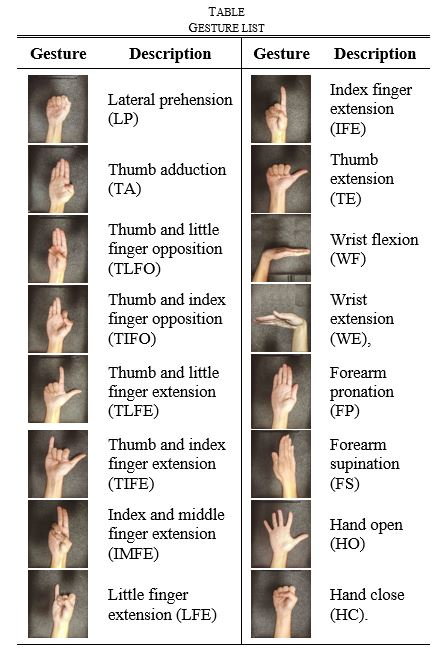
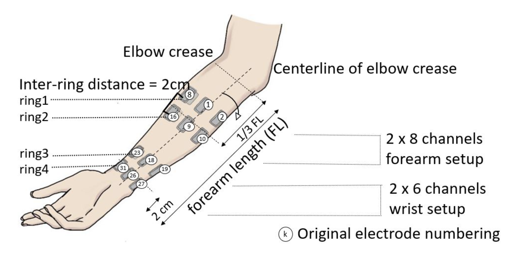

## Motivation

- Many data sets collected are high dimensional data with a covariance structure
  + RGB video - 6th dimension (x, y, r, b, g, time)
  + Medical imaging - 4th dimension (x, y, z, time)
  + Sensors over space and time   
- Established software implementations operations and approaches for vector variate and matrix variate data
- Often analysts will matricize data to fit these methodologies

::: {.hidden}
$$
\newcommand{\ve}[1]{\mathbf{#1}}
\newcommand{\field}[1]{\mathbb{#1}}
\newcommand{\defn}[1]{\emph{#1}}
\newcommand{\oneVect}[1]{#1}
\newcommand{\mat}[1]{\mathbf{#1}}
\newcommand{\oneMat}[1]{#1}
\newcommand{\tensor}[1]{\mathcal{#1}}
\newcommand{\oneTensor}[1]{#1}
\newcommand{\vs}[1]{\mathcal{#1}}
$$
:::


```{r, include = FALSE}
knitr::opts_chunk$set(dev = "png", dpi = 300)
library(tidyverse)
library(patchwork)
library(tensormodels)
theme_set(theme_minimal(16))
theme_update(plot.title = element_text(hjust = 0.5))

plot_matrix <- function(input) { # function to plot matrices
  input |>
    as_tibble(.name_repair = ~ paste0("V", seq_along(.))) |>
    mutate(row = row_number()) |>
    pivot_longer(-row, names_to = "col", values_to = "value") |>
    mutate(col = as.integer(str_remove(col, "^V"))) |>
    ggplot(aes(x = col, y = row, fill = value)) +
    geom_tile(color = "black", lwd = 0.1) +
    scale_y_reverse() +
    theme_minimal()
}
```


## Tensors
- Tensors - generalization of vectors and matrices 
- Order - number of indices needed to specify a value
    + Vector has order 1, matrix has order 2
- Mode - specific axis of tensor (rows = 1st mode, cols = 2nd mode)

<!-- {fig-align="center"} -->


## $\times_{n}$ Product
- Let $\tensor{A} \in \field{k}^{\color{red}{I_1} \times \color{red}{I_2} \times \dots \times \color{green}{I_n} \times \dots \times \color{red}{I_{O}}}$ and a matrix $\matrix{U} \in \field{k}^{\color{blue}{J} \times \color{green}{I_n}}$
- Then $\tensor{C} = \tensor{A} \times_{n} \mat{U}$ has entries

$$c_{\color{red}{i_1, \dots, i_{n-1},} \color{blue}{j} \color{red}{, i_{n+1}, \dots, i_O}} = \sum_{\color{green}{k=1}}^{\color{green}{I_n}} a_{\color{red}{i_1, \dots, i_{n-1}, \color{green}{k}, i_{n+1}, \dots, i_O}} b_{\color{blue}{j, \color{green}{k}}}$$

- Resulting object has order $O + P - 2 = O + 2 - 2 = O$ 
- Acts along mode $n$ while leaving the other modes intact

## Tensor Variate Normal (TVN)

<table style="font-size: 0.85em;">
<thead>
<tr>
<th>Object</th>
<th>Standard-normal</th>
<th>Transformation</th>
<th>Covariance structure</th>
</tr>
</thead>

<tbody>
<tr>
<td>Univar</td>
<td>$Z \in \mathbb{R}^{1}$</td>
<td>$X=\mu+\sigma Z$</td>
<td>$\sigma^2$</td>
</tr>

<tr class="fragment">
<td>Multivar</td>
<td>$\ve{Z}\in\mathbb{R}^{p}$</td>
<td>$\ve{X}=\boldsymbol{\mu}+\mat{A}\ve{Z}$</td>
<td>$\mat{A}\mat{A}^{T}=\Sigma$</td>
</tr>

<tr class="fragment">
<td>Matrix</td>
<td>$\mat{Z}\in\mathbb{R}^{p\times q}$</td>
<td>$\mat{X}=\mat{M} + \mat{A} \mat{Z} \mat{B}^{T}$</td>
<td>$U=\mat{A}\mat{A}^{T},\;V=\mat{B} \mat{B}^{T}$</td>
</tr>

<tr class="fragment">
<td>Tensor</td>
<td>$\tensor{Z}\in\mathbb{R}^{I_1 \times \cdots \times I_D}$</td>
<td>$\tensor{X}=\tensor{M} + \mathcal{Z} \times_{d=1}^{D} \mat{A}_{d}$
</td>
<td>$\Sigma_{d}=\mat{A}_{d}\mat{A}_{d}^{T}$</td>
</tr>
</tbody>
</table>

::: {.fragment}
- Note that the matrix transform can be written as 

$$\mat{X} = \mat{M} + \mat{Z} \times_{1} \mat{A} \times_{2} \mat{B}$$
:::

::: {.fragment}
- Start with IID standard normal draws in the structure, apply a linear transformation, add a mean
:::

## Tensor Variate Normal (TVN)

- Model assumption: separable covariance structure
  + Each mode $d$ has a covariance factor $\Sigma_d$
  + Together, the mode-specific factors define the full covariance: 
  
  $$\text{vec}(\mathcal{X}) \sim N(\text{vec}(\tensor{M}), \Sigma_D\otimes\cdots\otimes\Sigma_1)$$
  
::: {.fragment}
- Scaling identifiability issue: covariance structure is the same for different scalings of the covariance matrices
  + $\Sigma_3 \otimes \Sigma_{2} \otimes\Sigma_1 = a_{3} \Sigma_3 \otimes a_{2} \Sigma_{2} \otimes (a_{3} a_{2})^{-1} \Sigma_1$
  + Only the full Kronecker product is uniquely determined
:::


## TVN in tensortools

- `tensortools` supports r and d functions similar to base R
- `rtnorm()` requires arguments n, mu, sigmas
    + mu is the mean tensor. Its dimension is the same as the draws $\tensor{X}$ 
    + sigmas expects a list of covariance matrices. For mode $d$, $\Sigma_d \in \mathbb{R}^{I_d \times I_d}$

```{r, echo = FALSE}
mu_true <- tensor(data = 1:24, dim = c(2, 3, 4))

s1 <- matrix(c(
  1.0, 0.5,
  0.5, 1.0
), nrow = 2, byrow = TRUE)

s2 <- matrix(c(
  1.0, 0.4, 0.2,
  0.4, 1.0, 0.3,
  0.2, 0.3, 1.0
), nrow = 3, byrow = TRUE)

s3 <- matrix(c(
  1.0, 0.3, 0.2, 0.1,
  0.3, 1.0, 0.4, 0.2,
  0.2, 0.4, 1.0, 0.3,
  0.1, 0.2, 0.3, 1.0
), nrow = 4, byrow = TRUE)

sigmas_true <- list(s1, s2, s3)
```


```{r, echo = TRUE}
(draws <- rtnorm(n = 100, mu = mu_true, sigmas = list(s1, s2, s3)))
```

## TVN in tensortools

- Density evaluation is also supported with `dtnorm()`
  + Requires arguments x, mu, sigmas 

```{r, echo = TRUE}
dtnorm(draws[1], mu_true, sigmas = list(s1, s2, s3))
```


## TVN in tensortools

- MLE estimation is supported with `tensor_mle()`
  + Requires arguments draws and model 
  + Output is a list of the MLEs along with the log-likelihood, k, AIC, BIC

```{r, echo = TRUE}
tvn_mles <- tensor_mle(draws, model = "normal")

tvn_mles$sigmas[[1]]
s1
```


<!-- ```{r, echo = FALSE} -->
<!-- mu_mse <- mean((tvn_mles$mu - mu_true)^2) -->

<!-- sigma_mse <- sapply(seq_along(sigmas_true), function(i) { -->
<!--   true_scaled <- sigmas_true[[i]] / sum(diag(sigmas_true[[i]])) -->
<!--   est_scaled <- tvn_mles$sigmas[[i]] / -->
<!--     sum(diag(tvn_mles$sigmas[[i]])) -->

<!--   mean((est_scaled - true_scaled)^2) -->
<!-- }) -->

<!-- results <- data.frame( -->
<!--   Parameter = c("Mean tensor", paste0("Mode ", seq_along(sigma_mse), " covariance")), -->
<!--   MSE = c(mu_mse, sigma_mse) -->
<!-- ) -->

<!-- knitr::kable(results, digits = 4) -->
<!-- ``` -->

## Application: Gesture Recognition and Biometrics ElectroMyogram (GRABMyo)

- Electromyography data from **43 participants** treated as IID observations
- Each participant performed **16 hand gestures** in 7 repeated trials
- There were **28 active EMG channels**
- Collapse each 5-second recording at 2,048 Hz into **16 time bins**

::: {.fragment}
- Each observation is a $16\;\text{gestures}\times 28\;\text{channels}\times 16\;\text{time bins}$ tensor
:::

## GRABMyo: electrode layout and gesture set

::: {.columns}


::: {.column width="50%"}

{fig-alt="List of hand gestures in the GRABMyo dataset" width="75%"}
:::

::: {.column width="50%"}
{fig-alt="Electrode locations" width="100%"}
:::

:::

## GRABMyo Values

```{r, echo = FALSE}
grabmyo_data <- readRDS("grabmyo_session1_tensors_16x28x16.rds")
grabmyo_array <- simplify2array(grabmyo_data)
grabmyo_tensor <- as_tensor(grabmyo_array, obs = 4)

plot_matrix(grabmyo_tensor[1][1, , ]) +
  labs(x = "Time Bin", y = "EMG Channel", title = "Participant 1, Gesture 1", fill = "Log RMS-Amplitude")
```


<!-- ## From raw recordings to tensor-valued observations -->

<!-- The processing preserves the scientific modes while producing a compact sample: -->

<!-- 1. Convert the public WFDB recordings from device counts to millivolts. -->
<!-- 2. Remove the four unused channels, leaving 28 active EMG channels. -->
<!-- 3. Divide each five-second recording into 16 equal movement-phase bins. -->
<!-- 4. Compute log-RMS amplitude within each bin. -->
<!-- 5. Average the seven trials for each participant and gesture. -->

<!-- ::: {.fragment} -->
<!-- The result is a list of 43 tensors, each with dimensions -->

<!-- $$16\times28\times16.$$ -->
<!-- ::: -->

<!-- ::: {.fragment} -->
<!-- The preprocessing is not the contribution here; it creates a natural tensor-valued sample for evaluating the modeling workflow. -->
<!-- ::: -->

## GRABMyo Model Output
```{r grabmyo-fit-models, cache=TRUE}
grabmyo_fit_timed <- function(label, draws, model = "normal") {
  message(
    "Fitting ", label, " with dimensions ",
    paste(dim(draws[[1]]), collapse = " x ")
  )
  started <- Sys.time()
  fit <- tensor_mle(
    draws,
    model = model,
    max_iter = 1000,
    tol = 1e-6,
    quiet = FALSE
  )
  fit$elapsed_seconds <- as.numeric(difftime(
    Sys.time(), started, units = "secs"
  ))
  fit
}

#fit the tensor
grabmyo_fits <- list(tensor = grabmyo_fit_timed("tensor", grabmyo_tensor))

for (mode in 1:3) { #fit the matricizations
  matrix_draws <- matricization(grabmyo_tensor, k = mode) 
  label <- paste0("mat", mode)
  grabmyo_fits[[label]] <- grabmyo_fit_timed(label, matrix_draws)
  rm(matrix_draws)
}
```


```{r grabmyo-model-output}
grabmyo_dimensions <- c(
  tensor = "16 x 28 x 16",
  mat1 = "16 x 448",
  mat2 = "28 x 256",
  mat3 = "16 x 448"
)

grabmyo_results <- purrr::imap_dfr(
  grabmyo_fits,
  \(fit, model) tibble::tibble(
    model,
    dimensions = grabmyo_dimensions[[model]],
    loglik = fit$loglik,
    k = fit$k,
    BIC = fit$BIC,
    AIC = fit$AIC,
    secs = fit$elapsed_seconds
  )
) |>
  arrange(BIC) 


knitr::kable(
  grabmyo_results,
  digits = 1,
  booktabs = TRUE,
  caption = "Tensor-normal and matrix-normal fits to the GRABMyo data."
)
```


::: {.fragment}
- Matrix-normal have larger likelihoods because they are less constrained
- BIC favors the tensor model: reduction in complexity is worth the loss in likelihood
:::


## Skewed Tensor Distributions

$$\tensor{X} = \tensor{M} + W \tensor{A} + \sqrt{W} \tensor{V}, \qquad
\tensor{V}\sim\text{TVN}\!\left(\tensor{0},\{\Sigma_d\}_{d=1}^{D}\right).$$

```{r, echo=FALSE, results='asis'}
mixing_table <- data.frame(
  Distribution = c(
    "Skewed-t",
    "Generalized hyperbolic",
    "Variance-gamma",
    "Normal inverse Gaussian"
  ),
  `Distribution of W` = c(
    "Inverse-gamma(ν/2, ν/2)",
    "Gen Inv Gauss(ω, 1, λ)",
    "Gamma(γ, γ)",
    "Inv Gauss(1, κ)"
  ),
  Param = c(
    "ν",
    "λ, ω",
    "γ",
    "κ"
  ),
  `Support` = c(
    "ν > 0",
    "ω > 0; λ ∈ ℝ",
    "γ > 0",
    "κ > 0"
  ),
  check.names = FALSE
)

knitr::kable(
  mixing_table,
  format = "html",
  escape = TRUE,
  table.attr = 'style="width:100%;"'
) |>
  kableExtra::column_spec(1, width = "32%") |>
  kableExtra::column_spec(2, width = "38%") |>
  kableExtra::column_spec(3, width = "10%") |>
  kableExtra::column_spec(4, width = "20%")
```


## Skewed Tensor Distributions in `tensortools`

- `tensortools()` supports r, d, and MLE functions for all of these distributions

```{r, echo = FALSE}
skew_true <- array(data = seq(1, 10, length.out = prod(dim(mu_true))), dim = dim(mu_true))
```


```{r, echo = TRUE}
(skewt_draws <- rtskewt(n = 1e3, mu = mu_true, sigmas = sigmas_true,
                       skew = skew_true, nu = 20))

mle_skewt <- tensor_mle(skewt_draws, model = "skewt")
```

## GRABMyo Data with Skew

```{r, cache = TRUE}
grabmyo_non_normal_models <- c(
  "skewt", "vargamma", "invgauss", "genhyper"
)

grabmyo_distribution_fits <- c(
  normal = list(grabmyo_fits$tensor),
  purrr::map(
    purrr::set_names(grabmyo_non_normal_models),
    \(model) grabmyo_fit_timed(
      label = model,
      draws = grabmyo_tensor,
      model = model
    )
  )
)
```


```{r, echo = FALSE}
grabmyo_distribution_labels <- c(
  normal = "Normal",
  skewt = "Skew-t",
  vargamma = "Var Gamma",
  invgauss = "Norm Inv Gauss",
  genhyper = "Gen Hyper"
)

grabmyo_distribution_results <- purrr::imap_dfr(
  grabmyo_distribution_fits,
  \(fit, model) tibble::tibble(
    model = grabmyo_distribution_labels[[model]],
    parameter = switch(
      model,
      normal = "none",
      skewt = sprintf("nu = %.2f", fit$nu),
      vargamma = sprintf("gamma = %.3f", fit$gamma),
      invgauss = sprintf("kappa = %.2f", fit$kappa),
      genhyper = sprintf(
        "lambda = %.2f; omega = %.2f", fit$lambda, fit$omega
      )
    ),
    loglik = fit$loglik,
    k = fit$k,
    AIC = fit$AIC,
    BIC = fit$BIC,
    secs = fit$elapsed_seconds
  )
) |>
  arrange(BIC) 

knitr::kable(
  grabmyo_distribution_results,
  digits = 1,
  booktabs = TRUE,
  caption = paste(
    "Tensor distribution fits to the 43 processed GRABMyo",
    "participant tensors."
  )
)
```

- Skew-$t$ has lowest AIC and BIC even with an additional skew tensor
- The data exhibit skewness, so skew-$t$ is better than normal

<!-- ## Citations -->

<!-- ::: {#refs} -->
<!-- ::: -->

## Thank You! 

- Thank you to my advisors Dr. David Kahle and Dr. Michael Gallaugher
- Any questions? 
