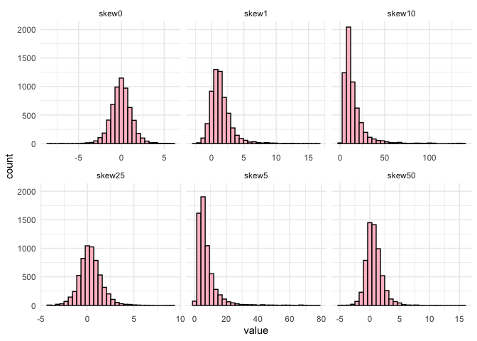
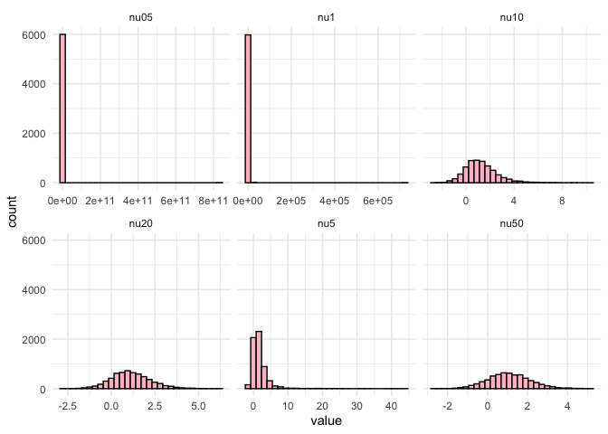

# **tensormodels**

Tensor operations, decompositions, and distributions in R.

``` r
library("tensormodels")
library("tidyverse")
old_digits <- getOption("digits")
options(digits = 3)
```

# Operations

## n-mode prod

The n-mode product between a tensor and a matrix can be computed with
`n_mode_prod`.

``` r
a <- array(1:3, dim = c(3, 1, 1))
x <- matrix(4:9, nrow = 2, ncol = 3)

n_prod(a, x, 1)
#> , , 1
#> 
#>      [,1]
#> [1,]   40
#> [2,]   46
```

## nm-mode prod

The nm-mode product between a tensor and a tensor can be computed with
`nm_prod()`.

``` r
A <- matrix(c(1, 2, 3, 4), nrow = 2)
x <- matrix(c(5, 6), nrow = 2)

nm_prod(A, x, 1, 1)
#>      [,1]
#> [1,]   17
#> [2,]   39
```

## [Tensor product](https://en.wikipedia.org/wiki/Tensor_product)

The tensor product between a tensor and a tensor can be computed with
`tensor_prod()`.

``` r
A <- matrix(c(1, 2, 3, 4), nrow = 2)
x <- matrix(c(5, 6), nrow = 2)

tensor_prod(A, x)
#> , , 1
#> 
#>      [,1] [,2]
#> [1,]    5   15
#> [2,]   10   20
#> 
#> , , 2
#> 
#>      [,1] [,2]
#> [1,]    6   18
#> [2,]   12   24
```

# Simulating tensor variate normal draws

The function `rtnorm()` simulates from the tensor variate normal with a
specified mean array mu and a list of covariance matrices called
list_sigmas.

Since the univariate normal and matrix variate normal are simpler cases
of the tensor variate normal, this function can simulate from them as
well. Here, we simulate from a univariate normal with mean $-2$ and
variance $4$.

``` r
univar_draws <- rtnorm(n = 1000, mu = -2, sigmas = 4)

mean(univar_draws)
#> [1] -2.12

sd(univar_draws)
#> [1] 1.99
```

And now we simulate from the matrix variate normal of size $2 \times 3$.
By default, the covariance matrices will be the identity.

``` r
matrix_draws <- rtnorm(n = 1e3, mu = matrix(1:6, nrow = 2, ncol = 3))

matrix_draws[1, , ]
#>       [,1] [,2] [,3]
#> [1,] 1.341 2.04 3.83
#> [2,] 0.461 5.49 5.95
```

Below is a simulation from a tensor variate normal of size
$3 \times 4 \times
2$.

``` r
tensor_draws <- rtnorm(n = 1e3, mu = array(1:24, dim = c(3, 4, 2)))

tensor_draws[1, , , ]
#> , , 1
#> 
#>       [,1] [,2] [,3] [,4]
#> [1,] 0.979 2.94 6.89 10.1
#> [2,] 1.409 4.73 7.59 10.2
#> [3,] 3.130 5.57 9.95 12.0
#> 
#> , , 2
#> 
#>      [,1] [,2] [,3] [,4]
#> [1,] 15.0 14.4 16.9 23.8
#> [2,] 13.2 19.1 21.2 24.5
#> [3,] 12.9 18.3 21.9 25.4
```

# Estimation

## MLE estimation for the tensor variate normal

The package supports MLE estimation for the mean and list of covariance
matrices.

``` r
univar_est <- mle_est(univar_draws)

univar_est$mu
#> [1] -2.12

univar_est$sigmas
#> [[1]]
#>      [,1]
#> [1,] 3.96
```

Here, the mean matrix from the draws above has values 1 through 6. The
covariance matrices are the identity matrices by default.

``` r
matrix_est <- mle_est(matrix_draws)
#> Iteration 1: max relative change = 6.667e-01
#> Iteration 2: max relative change = 3.827e-04
#> Iteration 3: max relative change = 5.834e-07
#> Converged at iteration 3

matrix_est$mu
#>      [,1] [,2] [,3]
#> [1,] 1.05 3.01 4.99
#> [2,] 1.98 4.05 6.01

matrix_est$sigmas |> lapply(round, 3)
#> [[1]]
#>       [,1]   [,2]
#> [1,]  1.02 -0.010
#> [2,] -0.01  0.984
#> 
#> [[2]]
#>        [,1]   [,2]   [,3]
#> [1,]  1.010  0.022 -0.010
#> [2,]  0.022  0.970 -0.009
#> [3,] -0.010 -0.009  1.020
```

This function works on array objects of dimensions above 2.

``` r
tensor_est <- mle_est(tensor_draws)
#> Iteration 1: max relative change = 7.500e-01
#> Iteration 2: max relative change = 9.260e-04
#> Iteration 3: max relative change = 1.010e-05
#> Iteration 4: max relative change = 3.509e-08
#> Converged at iteration 4

tensor_est$mu
#> , , 1
#> 
#>       [,1] [,2] [,3] [,4]
#> [1,] 0.978 3.98 6.99   10
#> [2,] 2.060 5.04 8.01   11
#> [3,] 2.962 6.03 9.04   12
#> 
#> , , 2
#> 
#>      [,1] [,2] [,3] [,4]
#> [1,] 12.9 16.0   19 21.9
#> [2,] 14.0 17.0   20 23.0
#> [3,] 15.0 18.1   21 24.0

tensor_est$sigmas |> lapply(round, 3)
#> [[1]]
#>       [,1]  [,2]  [,3]
#> [1,] 1.005 0.000 0.018
#> [2,] 0.000 0.991 0.007
#> [3,] 0.018 0.007 1.004
#> 
#> [[2]]
#>        [,1]   [,2]   [,3]   [,4]
#> [1,]  1.039  0.007  0.007 -0.004
#> [2,]  0.007  0.989 -0.020  0.004
#> [3,]  0.007 -0.020  0.970  0.004
#> [4,] -0.004  0.004  0.004  1.003
#> 
#> [[3]]
#>        [,1]   [,2]
#> [1,]  1.006 -0.009
#> [2,] -0.009  0.994
```

# Other models

## Tensor variate generalized hyperbolic

``` r
genhyper_draws <- rtgenhyper(n = 1e3)
```

## Tensor variate variance gamma

``` r
vargamma_draws <- rtvargamma(n = 1e3)
```

## Tensor variate normal inverse Gaussian

``` r
invgauss_draws <- rtinvgauss(n = 1e3)
```

## Assessing tensor variate normality

We can use the Mahalanobis distance to assess the tensor variate
normality. If we compute the distances and plot them, they should be
distributed as approximately $\chi_{p}$ where $p$ is the product of all
the modes of the draws.

``` r
centered_draws <- matrix_draws - array(rep(matrix_est$mu, each = n), dim = dim(matrix_draws))

inv_sqrt <- function(Sigma, tol = 1e-8) {
  # syemmetric matrix
  Sigma <- (Sigma + t(Sigma)) / 2
  
  eig <- eigen(Sigma, symmetric = TRUE)
  vals <- pmax(eig$values, tol)  # positive eigenvalues
  V <- eig$vectors
  
  Winv <- V %*% diag(1 / sqrt(vals), nrow = length(vals)) %*% t(V)
  Winv
}

D2 <- rep(0, n)
#> Error: cannot coerce type 'closure' to vector of type 'double'

inv_sigmas <- vector("list", length(matrix_est$sigmas))

for(k in 1:2) {
  inv_sigmas[[k]] <- inv_sqrt(matrix_est$sigmas[[k]])
}

for(i in 1:n) {
  Y <- centered_draws[i, , ]
  for(k in 1:2) {
    Y <- n_prod(Y, matrix_est$sigmas[[k]], k)
  }
  D2[i] <- sum(c(Y)^2)
}
#> Error in 1:n: NA/NaN argument

sigma2_hat <- mean(D2) / p
#> Error: object 'D2' not found
D2_std <- D2 / sigma2_hat    
#> Error: object 'D2' not found

ggplot() +
  geom_histogram(aes(x = D2_std, y = after_stat(density)), color = "black", fill = "pink", bins = 30) + 
  geom_function(fun = dchisq, args = list(df = prod(dim(matrix_est$mu))), color = "red") +
  theme_minimal() + 
  labs(x = "Mahalanobis distance", y = "Density")
#> Error in `geom_histogram()`:
#> ! Problem while computing aesthetics.
#> ℹ Error occurred in the 1st layer.
#> Caused by error:
#> ! object 'D2_std' not found
```

## Tensor Variate Skewed T

``` r
tibble(skew25 = c(rtskewt(n = 1e3, mu = matrix(0, nrow = 2, ncol = 3), skew = 0.25, nu = 6)),
       skew50 = c(rtskewt(n = 1e3, mu = matrix(0, nrow = 2, ncol = 3), skew = 0.5, nu = 6)),
       skew0 = c(rtskewt(n = 1e3, mu = matrix(0, nrow = 2, ncol = 3), skew = 0, nu = 6)),
       skew1 = c(rtskewt(n = 1e3, mu = matrix(0, nrow = 2, ncol = 3), skew = 1, nu = 6)),
       skew5 = c(rtskewt(n = 1e3, mu = matrix(0, nrow = 2, ncol = 3), skew = 5, nu = 6)),
       skew10 = c(rtskewt(n = 1e3, mu = matrix(0, nrow = 2, ncol = 3), skew = 10, nu = 6))) |>
  pivot_longer(cols = everything()) |>
  ggplot() +
  geom_histogram(aes(x = value), color = "black", fill = "pink") +
  facet_wrap(~name, nrow = 2, scales = "free_x") +
  theme_minimal()
#> `stat_bin()` using `bins = 30`. Pick better value `binwidth`.
```



``` r

tibble(nu05 = c(rtskewt(n = 1e3, mu = matrix(0, nrow = 2, ncol = 3), skew = 1, nu = 0.5)),
       nu1 = c(rtskewt(n = 1e3, mu = matrix(0, nrow = 2, ncol = 3), skew = 1, nu = 1)),
       nu5 = c(rtskewt(n = 1e3, mu = matrix(0, nrow = 2, ncol = 3), skew = 1, nu = 5)),
       nu10 = c(rtskewt(n = 1e3, mu = matrix(0, nrow = 2, ncol = 3), skew = 1, nu = 10)),
       nu20 = c(rtskewt(n = 1e3, mu = matrix(0, nrow = 2, ncol = 3), skew = 1, nu = 20)),
       nu50 = c(rtskewt(n = 1e3, mu = matrix(0, nrow = 2, ncol = 3), skew = 1, nu = 50))) |>
  pivot_longer(cols = everything()) |>
  ggplot() +
  geom_histogram(aes(x = value), color = "black", fill = "pink") +
  facet_wrap(~name, nrow = 2, scales = "free_x") +
  theme_minimal()
#> `stat_bin()` using `bins = 30`. Pick better value `binwidth`.
```



## Installation

You can install the development version of tensormodels from
[GitHub](https://github.com/) with:

``` r
if (!requireNamespace("remotes")) install.packages("remotes")
remotes::install_github("ankan12/tensormodels")
```

Reset digits

``` r
options(digits = old_digits)
```
