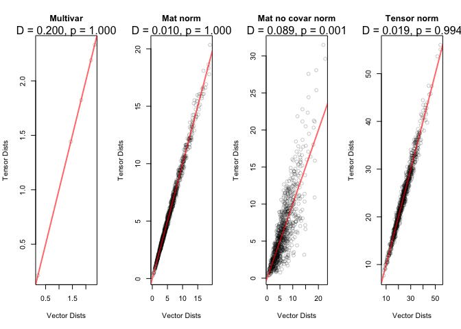
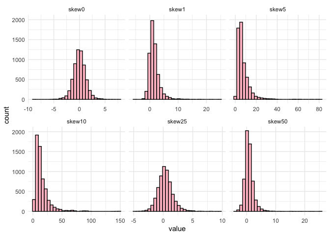
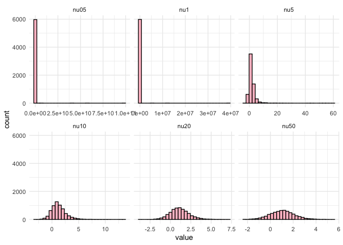

# **tensormodels**

Tensor operations, decompositions, and distributions in R.

``` r
library("tensormodels")
library("tidyverse")
library("tictoc")
old_digits <- getOption("digits")
options(digits = 3)
```

# Operations

## n-mode prod

The $n$-mode matrix product of a tensor
$\mathcal{A} \in \mathbb{k}^{I_1 \times I_2 \times ... \times I_n}$ with
a matrix $\textbf{U} \in \mathbb{k}^{J \times I_n}$  
is
$$(\mathcal{A} \times_n \textbf{U}) \in \mathbb{k}^{I_1 \times ... \times I_{n-1} \times J \times I_{n+1} \times ... \times I_N}$$
with entries
$$(\mathcal{A} \times_n \textbf{U})_{i_1, ..., i_{n-1}, j, i_{n+1}, ... I_N} = \sum_{i_n = 1}^{I_n} a_{i_1, i_2, \dots, i_N} u_{j, i_n}.$$
The tensor and matrix share one mode in common, denoted here as $I_n$.
This operation is also called the tensor times matrix product.

The n-mode product between a tensor and a matrix can be computed with
`n_mode_prod()`.

``` r
a <- array(1:3, dim = c(3, 1, 1))
x <- matrix(4:9, nrow = 2, ncol = 3)

n_prod(a, x, 1)
#> , , 1
#> 
#>      [,1]
#> [1,]   40
#> [2,]   46
```

## nm-mode prod

The nm-mode product between a tensor and a tensor can be computed with
`nm_prod()`.

``` r
A <- matrix(c(1, 2, 3, 4), nrow = 2)
x <- matrix(c(5, 6), nrow = 2)

nm_prod(A, x, 1, 1)
#>      [,1]
#> [1,]   17
#> [2,]   39
```

## [Tensor product](https://en.wikipedia.org/wiki/Tensor_product)

The tensor product between a tensor and a tensor can be computed with
`tensor_prod()`.

``` r
A <- matrix(c(1, 2, 3, 4), nrow = 2)
x <- matrix(c(5, 6), nrow = 2)

tensor_prod(A, x)
#> , , 1
#> 
#>      [,1] [,2]
#> [1,]    5   15
#> [2,]   10   20
#> 
#> , , 2
#> 
#>      [,1] [,2]
#> [1,]    6   18
#> [2,]   12   24
```

# Simulating tensor variate normal draws

The density function of the multilinear normal distribution
is<sup>1</sup>
$$f(x) = (2\pi)^{-p*/2} \left(\prod_{i=1}^{k} |\Sigma_i|^{-p*/(2\pi)}\right) \exp\left\{-\frac{1}{2} (x-\mu)^{T} \Sigma_{1:k}^{-1} (x-\mu)\right\}$$
where $\Sigma$ is positive definite, $x \in \mathbb{R}^p$,
$\mu \in \mathbb{R}^p$ and $\Sigma_{1:k} \in \mathbb{R}^p.$

The function `rtnorm()` simulates random draws from the tensor variate
normal with a specified mean array mu and a list of covariance matrices
called list_sigmas.

Since the univariate normal and matrix variate normal are simpler cases
of the tensor variate normal, this function can simulate from them as
well. Here, we simulate random draws from a univariate normal with mean
$-2$ and variance $4$.

``` r
univar_draws <- rtnorm(n = 1000, mu = -2, 
                       sigmas = list(matrix(4)))

mean(simplify2array(univar_draws))
#> [1] -2.02

var(simplify2array(univar_draws))
#> [1] 4.28
```

We can also simulate random draws from a multivariate normal
distribution by specifying a mean vector and the covariance matrix.

``` r
S1 <- crossprod(matrix(data = c(1, 0.5, 0.5, 1), nrow = 2))

(multivar_draws <- rtnorm(n = 5, mu = c(2, 3), sigmas = list(S1)))
#> [[1]]
#> [1] 3.27 2.90
#> 
#> [[2]]
#> [1] 3.24 4.54
#> 
#> [[3]]
#> [1] 1.026 0.938
#> 
#> [[4]]
#> [1] 2.24 2.35
#> 
#> [[5]]
#> [1] 2.08 3.73
```

And now we simulate from the matrix variate normal of size $2 \times 3$.
By default, the covariance matrices will be the identity.

``` r
matrix_draws <- rtnorm(n = 1e3, mu = matrix(1:6, nrow = 2, ncol = 3))

matrix_draws[[1]]
#>       [,1] [,2] [,3]
#> [1,] 0.459 3.50 4.19
#> [2,] 1.687 2.74 4.96
```

Below is a simulation from a tensor variate normal of size
$3 \times 4 \times
2$.The covariance structure is specified with a list of matrices.

``` r
mu_true <- array(1:24, dim = c(3, 4, 2))

S1 <- crossprod(matrix(rnorm(9), nrow = 3))
S2 <- crossprod(matrix(rnorm(16), nrow = 4))
S3 <- crossprod(matrix(rnorm(4), nrow = 2))

tvn_draws <- rtnorm(n = 1e3, mu = mu_true,
                    sigmas = list(S1, S2, S3))

tvn_draws[[1]]
#> , , 1
#> 
#>       [,1] [,2] [,3]  [,4]
#> [1,] 0.686 4.38 9.39  8.19
#> [2,] 1.202 1.88 8.96 11.30
#> [3,] 2.942 5.02 7.71 13.10
#> 
#> , , 2
#> 
#>       [,1]  [,2] [,3] [,4]
#> [1,]  5.00 -2.48 13.3 21.0
#> [2,]  9.47 10.08 32.6 14.9
#> [3,] 19.29 28.14 27.5 23.3
```

# Estimation

## MLE estimation for the tensor variate normal

The package supports MLE estimation. Given an array of draws, it will
return a list containing the MLE for the mean and covariance matrices.

``` r
(univarnorm_est <- tensor_mle(draws = univar_draws, model = "normal"))
#> $mu
#> [1] -2.02
#> 
#> $sigmas
#> $sigmas[[1]]
#> [1] 4.28
```

Here, the mean matrix from the draws above has values 1 through 6. The
covariance matrices are the identity matrices by default.

``` r
matrix_est <- tensor_mle(matrix_draws, model = "normal")

matrix_est$mu
#>       [,1] [,2] [,3]
#> [1,] 0.981 3.01 4.99
#> [2,] 2.025 3.98 5.99
matrix_est$sigmas |> lapply(round, 3)
#> [[1]]
#>        [,1]   [,2]
#> [1,]  1.001 -0.005
#> [2,] -0.005  0.999
#> 
#> [[2]]
#>        [,1]   [,2]   [,3]
#> [1,]  1.073 -0.034 -0.002
#> [2,] -0.034  1.026 -0.037
#> [3,] -0.002 -0.037  1.016
```

This function works for tensor-valued data.

``` r
tensor_est <- tensor_mle(draws = tvn_draws, model = "normal")

frob_norm_diff(tensor_est$mu, mu_true)
#> [1] 0.0125

true_sigmas <- list(S1, S2, S3)

for(i in 1:3) {
  true_scaled <- true_sigmas[[i]] / sum(diag(true_sigmas[[i]]))
  est_scaled <- tensor_est$sigmas[[i]] / sum(diag(tensor_est$sigmas[[i]]))
  
  print(frob_norm(true_scaled - est_scaled) / frob_norm(true_scaled))
}
#> [1] 0.0142
#> [1] 0.0239
#> [1] 0.00424
```

# Other models

## Tensor variate normal inverse Gaussian

The density function of the normal inverse Gaussian distribution is

$$f_{\text{TVNIG}}(\mathcal{X}|\textbf{V}) =
\frac{2 \exp\left\{\text{vec}(\mathcal{X} - \mathcal{M})^{T} \bigotimes_{d=1}^{D} \Sigma_{d}^{-1} \text{vec}(\mathcal{A} + \kappa) \right\}}{(2\pi)^{\frac{n^{*}}{2}} \prod_{d=1}^{D} |\Sigma_{d}|^{\frac{n^{*}}{2n_{d}}}} \left(\frac{\delta(\mathcal{X}; \mathcal{M}, \bigotimes_{d=1}^{D} \Sigma_{d}^{-1}) + 1}{\rho(\mathcal{A}, \bigotimes_{d=1}^{D} \Sigma_{d}^{-1}) + \kappa^2}\right)^{-\frac{1 + n^{*}}{4}}$$

$$\quad K_{- \frac{1 + n^{*}}{2}} \left(\sqrt{[\rho(\mathcal{A}, \bigotimes_{d=1}^{D} \Sigma_{d}^{-1}) + \kappa^{2}] \left[\delta(\mathcal{X}; \mathcal{M}, \bigotimes_{d=1}^{D} \Sigma_{d}^{-1}) + 1\right]\right)$$
where $\Sigma$ is positive definite, $x \in \mathbb{R}^p$,
$\mu \in \mathbb{R}^p$ and $\Sigma_{1:k} \in \mathbb{R}^p.$

The function `rtinvgauss()` simulates random draws from the tensor
variate normal inverse Gaussian with a specified mean array mu, a list
of covariance matrices, a skew array, and $\kappa$ which describes the
shape of the inverse Gaussian distribution

``` r
mu_true <- array(1:12, dim = c(3, 4))
skew_true <- array(seq(0, 4, length.out = 12), dim = c(3, 4))
kappa_true <- 2

invgauss_draws <- rtinvgauss(n = 1e3, mu = mu_true, skew = skew_true, 
                             sigmas = list(S1, S2), kappa = kappa_true)
```

``` r
mu_true <- array(1:24, dim = c(3, 4, 2))
skew_true <- array(seq(0, 4, length.out = 24), dim = c(3, 4, 2))
kappa_true <- 2

invgauss_draws <- rtinvgauss(n = 1e3, mu = mu_true, skew = skew_true, 
                             sigmas = list(S1, S2, S3), kappa = kappa_true)
```

``` r
invgauss_est <- tensor_mle(invgauss_draws, model = "invgauss", 
                           quiet = FALSE, tol = 1e-3)
#> Converged at iteration 40
```

For the inverse gaussian distribution, the true mean
$E[X] = \mathcal{M} + \mathcal{A}/\kappa$. We can compare the model’s
estimation for the mean with the true values.

``` r
frob_norm_diff(with(invgauss_est, mu + skew/kappa),
               mu_true + skew_true/kappa_true)
#> [1] 0.00538
```

``` r
frob_norm_diff(invgauss_est$mu, mu_true)
#> [1] 0.0162
frob_norm_diff(invgauss_est$skew, skew_true)
#> [1] 0.669
invgauss_est$kappa
#> [1] 0.752

for(i in 1:2) {
  true_scaled <- true_sigmas[[i]] / sum(diag(true_sigmas[[i]]))
  est_scaled <- invgauss_est$sigmas[[i]] / sum(diag(invgauss_est$sigmas[[i]]))
  
  print(frob_norm(true_scaled - est_scaled) / frob_norm(true_scaled))
}
#> [1] 0.00724
#> [1] 0.00767
```

## Tensor variate generalized hyperbolic

The density function of the generalized hyperbolic distribution is
$$f(x) = (2\pi)^{-p*/2} \left(\prod_{i=1}^{k} |\Sigma_i|^{-p*/(2\pi)}\right) \exp\left\{-\frac{1}{2} (x-\mu)' \Sigma_{1:k}^{-1} (x-\mu\right\}$$
where $\Sigma$ is positive definite, $x \in \mathbb{R}^p$,
$\mu \in \mathbb{R}^p$ and $\Sigma_{1:k} \in \mathbb{R}^p.$

The function `rtgenhyper()` simulates random draws from the tensor
variate generalized hyperbolic with a specified mean array mu and a list
of covariance matrices called list_sigmas.

Since the univariate normal and matrix variate normal are simpler cases
of the tensor variate normal, this function can simulate from them as
well. Here, we simulate random draws from a univariate normal with mean
$-2$ and variance $4$.

``` r
lambda_true <- 2
omega_true <- 2

genhyper_draws <- rtgenhyper(n = 1e3, mu = mu_true, skew = skew_true,
                             sigmas = list(S1, S2, S3))
```

For the generalized hyperbolic distribution, the true mean
$E[X] = \mathcal{M} + \frac{K_{\lambda + 1}(\omega)}{K_{\lambda}(\omega)} \mathcal{A}$.
We can compare the model’s estimation for the mean with the true values.

``` r
genhyper_est <- tensor_mle(genhyper_draws, model = "genhyper", quiet = FALSE)
#> Converged at iteration 10

frob_norm_diff(
  with(genhyper_est, mu + besselK(x = omega, nu = lambda + 1)/
                          besselK(x = omega, nu = lambda) * skew),
       mu_true + besselK(x = omega_true, nu = lambda_true + 1)/
                 besselK(x = omega_true, nu = lambda_true) * skew_true)
#> [1] 0.0132

frob_norm_diff(genhyper_est$mu, mu_true)
#> [1] 0.0603
frob_norm_diff(genhyper_est$skew, skew_true)
#> [1] 0.842

for(i in 1:3) {
  true_scaled <- true_sigmas[[i]] / sum(diag(true_sigmas[[i]]))
  est_scaled <- genhyper_est$sigmas[[i]] / sum(diag(genhyper_est$sigmas[[i]]))
  
  print(frob_norm(true_scaled - est_scaled) / frob_norm(true_scaled))
}
#> [1] 0.0066
#> [1] 0.0275
#> [1] 0.0866

genhyper_est$lambda
#> [1] 2.1
genhyper_est$omega
#> [1] 0.31
```

## Tensor variate variance gamma

``` r
vargamma_draws <- rtvargamma(n = 1e3, mu = mu_true, skew = skew_true,
                             sigmas = list(S1, S2, S3))
```

``` r
vargamma_est <- tensor_mle(vargamma_draws, model = "vargamma", quiet = FALSE)
#> Converged at iteration 8

frob_norm_diff(with(vargamma_est, mu + skew),
               mu_true + skew_true)
#> [1] 0.107

frob_norm_diff(vargamma_est$mu, mu_true)
#> [1] 0.0104
frob_norm_diff(vargamma_est$skew, skew_true)
#> [1] 0.781

for(i in 1:3) {
  true_scaled <- true_sigmas[[i]] / sum(diag(true_sigmas[[i]]))
  est_scaled <- vargamma_est$sigmas[[i]] / sum(diag(vargamma_est$sigmas[[i]]))
  
  print(frob_norm(true_scaled - est_scaled) / frob_norm(true_scaled))
}
#> [1] 0.00856
#> [1] 0.0229
#> [1] 0.0625

vargamma_est$gamma
#> [1] 0.299
```

## Tensor variate skewed t

``` r
nu_true <- 20
skew_true <- array(c(
   0.6,  0.3, -0.2,  0.5,
   0.4, -0.5,  0.2, -0.3,
  -0.4,  0.7,  0.1, -0.6,

   0.5, -0.2,  0.3,  0.4,
  -0.3,  0.6, -0.4,  0.2,
   0.1, -0.5,  0.7, -0.1
), dim = c(3, 4, 2))

skewt_draws <- rtskewt(n = 1e3, mu = mu_true, skew = skew_true,
                       sigmas = list(S1, S2, S3), nu = nu_true)
```

``` r
skewt_est <- tensor_mle(skewt_draws, model = "skewt",
                        quiet = FALSE, tol = 1e-3)
#> Converged at iteration 19

frob_norm_diff(with(skewt_est, mu + (nu)/(nu-2) * skew),
               mu_true + nu_true / (nu_true - 2) * skew_true)
#> [1] 0.0186

for(i in 1:3) {
  true_scaled <- true_sigmas[[i]] / sum(diag(true_sigmas[[i]]))
  est_scaled <- skewt_est$sigmas[[i]] / sum(diag(skewt_est$sigmas[[i]]))
  
  print(frob_norm_diff(est_scaled, true_scaled))
}
#> [1] 0.00502
#> [1] 0.00582
#> [1] 0.00821
```

## Assessing tensor variate normality

We can use the Mahalanobis distance to assess the tensor variate
normality. If we compute the distances and plot them, they should be
distributed as approximately $\chi_{p}$ where $p$ is the product of all
the modes of the draws.

``` r
A <- matrix(rnorm(6^2), 6, 6)
s_vec <- crossprod(A)   # positive definite, general covariance

vec_draws <- rtnorm(n = 1e3, mu = 1:6, sigmas = list(s_vec))

matrix_nocovar_draws <- lapply(1:1e3, function(i) {
  array(vec_draws[[i]], dim = c(2, 3))
})
```

``` r
plot_malanobis <- function(draws, title = "Dist") {
  distances <- mahalanobis_dist(draws)
  test <- mahalanobis_test(distances)
  plot_dist(distances)
  title(main = title)
  with(test, mtext(text = sprintf("D = %.3f, p = %.3f", statistic, p.value)), 
       side = 3, line = 1)
}
```

``` r
par(mfcol = c(1, 4))
plot_malanobis(multivar_draws, title = "Multivar")
plot_malanobis(matrix_draws, title = "Mat norm")
plot_malanobis(matrix_nocovar_draws, title = "Mat no covar norm")
plot_malanobis(tvn_draws, title = "Tensor norm")
```



We are also interested in performing a likelihood ratio test. We are
curious if one of the covariance matrices might be the identity matrix.
Thus, we run the algorithm and restrict these matrices.

For a restriction set $\mathcal{R} \subset \{1,\ldots,D\}$, the
restricted model fixes $\Sigma_r = I_{n_r}$ for every
$r \in \mathcal{R}$, while all other covariance matrices are estimated.
The likelihood ratio test compares

$$H_0: \Sigma_r = I_{n_r} \ \forall r \in \mathcal{R} \quad \text{vs.} \quad H_A: \Sigma_r \neq I_{n_r} \ \text{for at least one } r \in \mathcal{R}.$$

The test statistic is

$$2\{\ell(\hat\theta_{\mathrm{full}}) - \ell(\hat\theta_{\mathcal{R}})\}
\sim \chi^2_{\nu_{\mathcal{R}}}, \quad \nu_{\mathcal{R}} = \sum_{r \in \mathcal{R}} \left\{\frac{n_r(n_r+1)}{2} - 1\right\}$$

If the $p$-value is large, then we fail to reject the null hypothesis
and conclude the restricted model fits the data as well as the
unrestricted model. If the $p$-value is small, we reject the null
hypothesis, which states the unrestricted model has a significantly
better fit than the restricted model.

``` r
true_str <- kronecker(S3, S2) |> kronecker(S1)
  
test_restrict <- function(draws, restrict) {
  curr_restrict <- tensor_mle(draws, restrict = restrict, model = "normal")
  
  if(is.null(restrict)) restrict <- "None"

  curr_str <- with(curr_restrict, kronecker(sigmas[[3]], sigmas[[2]]) |>
                                  kronecker(sigmas[[1]]))

  tibble(frob_error = frob_norm_diff(curr_str, true_str),
         loglik = curr_restrict$loglik,
         k = curr_restrict$k,
         BIC = curr_restrict$BIC,
         restrict = paste(restrict, collapse = ", "))
}

(res <- map_dfr(list(NULL, c(1), c(2), c(3), c(1, 2), c(1, 3), c(2, 3)),
        draws = tvn_draws, test_restrict))
#> # A tibble: 7 × 5
#>   frob_error loglik     k   BIC restrict
#>        <dbl>  <dbl> <dbl> <dbl> <chr>   
#> 1     0.0415  -13.3    41  310. None    
#> 2     0.725   -52.0    36  353. 1       
#> 3     0.673   -56.6    32  334. 2       
#> 4     0.977  -249.     39  767. 3       
#> 5     0.860   -95.1    27  377. 1, 2    
#> 6     0.989  -283.     34  800. 1, 3    
#> 7     0.987  -287.     30  781. 2, 3
```

``` r
lrt_test <- function(draws, restrict) {
  full_model <- tensor_mle(draws, model = "normal")
  restrict_model <- tensor_mle(draws, model = "normal", restrict = restrict)
  
  pval <- pchisq(2 * (full_model$loglik - restrict_model$loglik), 
                 df = full_model$k - restrict_model$k, lower.tail = FALSE)
  
  tibble(restrict = paste(restrict, collapse = ", "), 
         pval = pval)
}

map_dfr(list(NULL, c(1), c(2), c(3), c(1, 2), c(1, 3), c(2, 3)),
        draws = tvn_draws, lrt_test)
#> # A tibble: 7 × 2
#>   restrict      pval
#>   <chr>        <dbl>
#> 1 ""       1   e+  0
#> 2 "1"      2.75e- 15
#> 3 "2"      7.56e- 15
#> 4 "3"      6.10e-103
#> 5 "1, 2"   1.34e- 27
#> 6 "1, 3"   3.71e-112
#> 7 "2, 3"   2.87e-110
```

``` r
true_str <- kronecker(S3, diag(4)) |> kronecker(S1)

second_identity <- rtnorm(n = 1e3, mu = mu_true, 
                          sigmas = list(S1, diag(4), S3))

map_dfr(list(NULL, c(1), c(2), c(3), c(1, 2), c(1, 3), c(2, 3)), 
        draws = second_identity, test_restrict)
#> # A tibble: 7 × 5
#>   frob_error loglik     k   BIC restrict
#>        <dbl>  <dbl> <dbl> <dbl> <chr>   
#> 1     0.0508  -16.3    41  316. None    
#> 2     0.725   -54.7    36  358. 1       
#> 3     0.0375  -16.3    32  254. 2       
#> 4     0.878   -39.3    39  348. 3       
#> 5     0.724   -54.8    27  296. 1, 2    
#> 6     0.944   -77.8    34  390. 1, 3    
#> 7     0.878   -39.3    30  286. 2, 3

map_dfr(list(NULL, c(1), c(2), c(3), c(1, 2), c(1, 3), c(2, 3)),
        draws = second_identity, lrt_test)
#> # A tibble: 7 × 2
#>   restrict     pval
#>   <chr>       <dbl>
#> 1 ""       1   e+ 0
#> 2 "1"      3.57e-15
#> 3 "2"      1.00e+ 0
#> 4 "3"      1.02e-10
#> 5 "1, 2"   9.98e-11
#> 6 "1, 3"   1.72e-23
#> 7 "2, 3"   3.14e- 6
```

## Tensor Variate Skewed T

``` r
tibble(skew25 = unlist(rtskewt(n = 1e3, mu = matrix(0, nrow = 2, ncol = 3), 
                               skew = matrix(0.25, nrow = 2, ncol = 3), nu = 6)),
       skew50 = unlist(rtskewt(n = 1e3, mu = matrix(0, nrow = 2, ncol = 3), 
                               skew = matrix(0.5, nrow = 2, ncol = 3), nu = 6)),
       skew0 = unlist(rtskewt(n = 1e3, mu = matrix(0, nrow = 2, ncol = 3), 
                              skew = matrix(0, nrow = 2, ncol = 3), nu = 6)),
       skew1 = unlist(rtskewt(n = 1e3, mu = matrix(0, nrow = 2, ncol = 3), 
                              skew = matrix(1, nrow = 2, ncol = 3), nu = 6)),
       skew5 = unlist(rtskewt(n = 1e3, mu = matrix(0, nrow = 2, ncol = 3), 
                              skew = matrix(5, nrow = 2, ncol = 3), nu = 6)),
       skew10 = unlist(rtskewt(n = 1e3, mu = matrix(0, nrow = 2, ncol = 3), 
                               skew = matrix(10, nrow = 2, ncol = 3), nu = 6))) |>
  pivot_longer(cols = everything()) |> 
  mutate(name = factor(name, levels = c("skew0", "skew1", 
                                     "skew5", "skew10", "skew25", "skew50"))) |> 
  ggplot() +
  geom_histogram(aes(x = value), color = "black", fill = "pink") +
  facet_wrap(~name, nrow = 2, scales = "free_x") +
  theme_minimal()
#> `stat_bin()` using `bins = 30`. Pick better value `binwidth`.
```



``` r

tibble(nu05 = unlist(rtskewt(n = 1e3, mu = matrix(0, nrow = 2, ncol = 3), 
                             skew = matrix(1, nrow = 2, ncol = 3), nu = 0.5)),
       nu1 = unlist(rtskewt(n = 1e3, mu = matrix(0, nrow = 2, ncol = 3), 
                            skew = matrix(1, nrow = 2, ncol = 3), nu = 1)),
       nu5 = unlist(rtskewt(n = 1e3, mu = matrix(0, nrow = 2, ncol = 3), 
                            skew = matrix(1, nrow = 2, ncol = 3), nu = 5)),
       nu10 = unlist(rtskewt(n = 1e3, mu = matrix(0, nrow = 2, ncol = 3), 
                             skew = matrix(1, nrow = 2, ncol = 3), nu = 10)),
       nu20 = unlist(rtskewt(n = 1e3, mu = matrix(0, nrow = 2, ncol = 3), 
                             skew = matrix(1, nrow = 2, ncol = 3), nu = 20)),
       nu50 = unlist(rtskewt(n = 1e3, mu = matrix(0, nrow = 2, ncol = 3), 
                             skew = matrix(1, nrow = 2, ncol = 3), nu = 50))) |>
  pivot_longer(cols = everything()) |>
  mutate(name = factor(name, levels = c("nu05", "nu1", "nu5", "nu10", "nu20", "nu50"))) |> 
  ggplot() +
  geom_histogram(aes(x = value), color = "black", fill = "pink") +
  facet_wrap(~name, nrow = 2, scales = "free_x") +
  theme_minimal()
#> `stat_bin()` using `bins = 30`. Pick better value `binwidth`.
```



## Installation

You can install the development version of tensormodels from
[GitHub](https://github.com/) with:

``` r
if (!requireNamespace("remotes")) install.packages("remotes")
remotes::install_github("ankan12/tensormodels")
```

Reset digits

``` r
options(digits = old_digits)
```

<div id="refs" class="references csl-bib-body" entry-spacing="0"
line-spacing="2">

<div id="ref-tensornormprop" class="csl-entry">

<span class="csl-left-margin">1.
</span><span class="csl-right-inline">Ohlson, M., Rauf Ahmad, M. & von
Rosen, D. [The multilinear normal distribution: Introduction and some
basic properties](https://doi.org/10.1016/j.jmva.2011.05.015). *Journal
of Multivariate Analysis* **113**, 37–47 (2013).</span>

</div>

</div>
