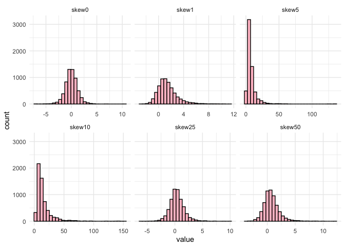
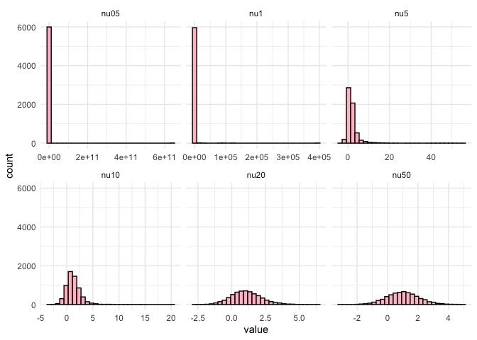

# **tensormodels**

Tensor operations, decompositions, and distributions in R.

``` r
library("tensormodels")
library("tidyverse")
old_digits <- getOption("digits")
options(digits = 3)
```

# Operations

## n-mode prod

The $n$-mode matrix product of a tensor
$\mathcal{A} \in \mathbb{k}^{I_1 \times I_2 \times ... \times I_n}$ with
a matrix $\textbf{U} \in \mathbb{k}^{J \times I_n}$  
is
$$(\mathcal{A} \times_n \textbf{U}) \in \mathbb{k}^{I_1 \times ... \times I_{n-1} \times J \times I_{n+1} \times ... \times I_N}$$
with entries
$$(\mathcal{A} \times_n \textbf{U})_{i_1, ..., i_{n-1}, j, i_{n+1}, ... I_N} = \sum_{i_n = 1}^{I_n} a_{i_1, i_2, \dots, i_N} u_{j, i_n}.$$
The tensor and matrix share one mode in common, denoted here as $I_n$.
This operation is also called the tensor times matrix product.

The n-mode product between a tensor and a matrix can be computed with
`n_mode_prod()`.

``` r
a <- array(1:3, dim = c(3, 1, 1))
x <- matrix(4:9, nrow = 2, ncol = 3)

n_prod(a, x, 1)
#> , , 1
#> 
#>      [,1]
#> [1,]   40
#> [2,]   46
```

## nm-mode prod

The nm-mode product between a tensor and a tensor can be computed with
`nm_prod()`.

``` r
A <- matrix(c(1, 2, 3, 4), nrow = 2)
x <- matrix(c(5, 6), nrow = 2)

nm_prod(A, x, 1, 1)
#>      [,1]
#> [1,]   17
#> [2,]   39
```

## [Tensor product](https://en.wikipedia.org/wiki/Tensor_product)

The tensor product between a tensor and a tensor can be computed with
`tensor_prod()`.

``` r
A <- matrix(c(1, 2, 3, 4), nrow = 2)
x <- matrix(c(5, 6), nrow = 2)

tensor_prod(A, x)
#> , , 1
#> 
#>      [,1] [,2]
#> [1,]    5   15
#> [2,]   10   20
#> 
#> , , 2
#> 
#>      [,1] [,2]
#> [1,]    6   18
#> [2,]   12   24
```

# Simulating tensor variate normal draws

The density function of the multilinear normal distribution
is<sup>1</sup>
$$f(x) = (2\pi)^{-p*/2} \left(\prod_{i=1}^{k} |\Sigma_i|^{-p*/(2\pi)}\right) \exp\left\{-\frac{1}{2} (x-\mu)' \Sigma_{1:k}^{-1} (x-\mu\right\}$$
where $\Sigma$ is positive definite, $x \in \mathbb{R}^p$,
$\mu \in \mathbb{R}^p$ and $\Sigma_{1:k} \in \mathbb{R}^p.$

The function `rtnorm()` simulates random draws from the tensor variate
normal with a specified mean array mu and a list of covariance matrices
called list_sigmas.

Since the univariate normal and matrix variate normal are simpler cases
of the tensor variate normal, this function can simulate from them as
well. Here, we simulate random draws from a univariate normal with mean
$-2$ and variance $4$.

``` r
univar_draws <- rtnorm(n = 1000, mu = -2, sigmas = 4)

mean(simplify2array(univar_draws))
#> [1] -2.03

var(simplify2array(univar_draws))
#> [1] 4.27
```

We can also simulate random draws from a multivariate normal
distribution by specifying a mean vector and the covariance matrix.

``` r
S1 <- crossprod(matrix(data = c(1, 0.5, 0.5, 1), nrow = 2))

(multivar_draws <- rtnorm(n = 5, mu = c(2, 3), sigmas = list(S1)))
#> [[1]]
#> [1] 3.26 2.77
#> 
#> [[2]]
#> [1] 1.25 3.05
#> 
#> [[3]]
#> [1] 1.80 3.27
#> 
#> [[4]]
#> [1] 1.34 3.00
#> 
#> [[5]]
#> [1] 3.69 4.06
```

And now we simulate from the matrix variate normal of size $2 \times 3$.
By default, the covariance matrices will be the identity.

``` r
matrix_draws <- rtnorm(n = 1e3, mu = matrix(1:6, nrow = 2, ncol = 3))

matrix_draws[[1]]
#>       [,1] [,2] [,3]
#> [1,] 0.657 3.11 5.89
#> [2,] 1.965 2.87 7.48
```

Below is a simulation from a tensor variate normal of size
$3 \times 4 \times
2$.The covariance structure is specified with a list of matrices.

``` r
S1 <- crossprod(matrix(rnorm(9), nrow = 3))
S2 <- crossprod(matrix(rnorm(16), nrow = 4))
S3 <- crossprod(matrix(rnorm(4), nrow = 2))

tvn_draws <- rtnorm(n = 1e3, mu = array(1:24, dim = c(3, 4, 2)),
                    sigmas = list(S1, S2, S3))

tvn_draws[[1]]
#> , , 1
#> 
#>        [,1] [,2]  [,3]  [,4]
#> [1,] -25.99 1.17 14.60 22.52
#> [2,]  15.70 7.07  3.71  4.68
#> [3,]  -2.58 5.83 10.25 14.63
#> 
#> , , 2
#> 
#>       [,1] [,2] [,3] [,4]
#> [1,] 34.50 20.4 13.5 13.0
#> [2,]  1.06 15.8 23.5 29.2
#> [3,] 17.95 19.7 20.4 23.4
```

# Estimation

## MLE estimation for the tensor variate normal

The package supports MLE estimation. Given an array of draws, it will
return a list containing the MLE for the mean and covariance matrices.

``` r
(univarnorm_est <- tensor_mle(draws = univar_draws, model = "normal"))
#> $mu
#> [1] -2.03
#> 
#> $sigmas
#> $sigmas[[1]]
#> [1] 4.27
```

Here, the mean matrix from the draws above has values 1 through 6. The
covariance matrices are the identity matrices by default.

``` r
matrix_est <- tensor_mle(matrix_draws, model = "normal")

matrix_est$mu
#>       [,1] [,2] [,3]
#> [1,] 0.977 3.00 5.01
#> [2,] 2.069 4.01 6.04
matrix_est$sigmas |> lapply(round, 3)
#> [[1]]
#>       [,1]  [,2]
#> [1,] 1.000 0.017
#> [2,] 0.017 1.033
#> 
#> [[2]]
#>       [,1]  [,2]  [,3]
#> [1,] 0.961 0.011 0.033
#> [2,] 0.011 0.960 0.053
#> [3,] 0.033 0.053 0.949
```

This function works for tensor-valued data.

``` r
tensor_est <- tensor_mle(draws = tvn_draws, model = "normal")

tensor_est$mu
#> , , 1
#> 
#>       [,1] [,2] [,3] [,4]
#> [1,] 0.872 3.94 6.94 10.2
#> [2,] 2.017 5.11 8.03 10.9
#> [3,] 2.938 6.04 8.99 12.1
#> 
#> , , 2
#> 
#>      [,1] [,2] [,3] [,4]
#> [1,] 13.1 15.8 19.1 21.9
#> [2,] 14.0 17.1 20.0 23.0
#> [3,] 15.1 17.9 21.0 23.9

true_sigmas <- list(S1, S2, S3)

for(i in 1:3) {
  true_scaled <- true_sigmas[[i]] / sum(diag(true_sigmas[[i]]))
  est_scaled <- tensor_est$sigmas[[i]] / sum(diag(tensor_est$sigmas[[i]]))
  
  print(frob_norm(true_scaled - est_scaled) / frob_norm(true_scaled))
}
#> [1] 0.0028
#> [1] 0.0198
#> [1] 0.00392
```

# Other models

The density function of the normal inverse Gaussian distribution is

$$f_{\text{TVNIG}}(\mathcal{X}|\textbf{V}) =
\frac{2 \exp\left\{\text{vec}(\mathcal{X} - \mathcal{M})^{T} \bigotimes_{d=1}^{D} \Sigma_{d}^{-1} \text{vec}(\mathcal{A} + \kappa) \right\}}{(2\pi)^{\frac{n^{*}}{2}} \prod_{d=1}^{D} |\Sigma_{d}|^{\frac{n^{*}}{2n_{d}}}} \left(\frac{\delta(\mathcal{X}; \mathcal{M}, \bigotimes_{d=1}^{D} \Sigma_{d}^{-1}) + 1}{\rho(\mathcal{A}, \bigotimes_{d=1}^{D} \Sigma_{d}^{-1}) + \kappa^2}\right)^{-\frac{1 + n^{*}}{4}}$$

$$\quad K_{- \frac{1 + n^{*}}{2}} \left(\sqrt{[\rho(\mathcal{A}, \bigotimes_{d=1}^{D} \Sigma_{d}^{-1}}) + \kappa^{2}] \left[\delta(\mathcal{X}; \mathcal{M}, \bigotimes_{d=1}^{D} \Sigma_{d}^{-1}) + 1\right]\right)$$
where $\Sigma$ is positive definite, $x \in \mathbb{R}^p$,
$\mu \in \mathbb{R}^p$ and $\Sigma_{1:k} \in \mathbb{R}^p.$

The function `rtnorm()` simulates random draws from the tensor variate
normal with a specified mean array mu and a list of covariance matrices
called list_sigmas.

Since the univariate normal and matrix variate normal are simpler cases
of the tensor variate normal, this function can simulate from them as
well. Here, we simulate random draws from a univariate normal with mean
$-2$ and variance $4$.

## Tensor variate normal inverse Gaussian

``` r
invgauss_draws <- rtinvgauss(n = 1e3, mu = array(1:24, dim = c(3, 4, 2)))
```

``` r
# invgauss_est <- tensor_mle(invgauss_draws, model = "invgauss", quiet = FALSE)
# 
# invgauss_est$mu
# invgauss_est$skew |> round(3) 
# invgauss_est$sigmas |> lapply(round, 3)
# invgauss_est$kappa
```

## Tensor variate generalized hyperbolic

The density function of the generalized hyperbolic distribution is
$$f(x) = (2\pi)^{-p*/2} \left(\prod_{i=1}^{k} |\Sigma_i|^{-p*/(2\pi)}\right) \exp\left\{-\frac{1}{2} (x-\mu)' \Sigma_{1:k}^{-1} (x-\mu\right\}$$
where $\Sigma$ is positive definite, $x \in \mathbb{R}^p$,
$\mu \in \mathbb{R}^p$ and $\Sigma_{1:k} \in \mathbb{R}^p.$

The function `rtnorm()` simulates random draws from the tensor variate
normal with a specified mean array mu and a list of covariance matrices
called list_sigmas.

Since the univariate normal and matrix variate normal are simpler cases
of the tensor variate normal, this function can simulate from them as
well. Here, we simulate random draws from a univariate normal with mean
$-2$ and variance $4$.

``` r
genhyper_draws <- rtgenhyper(n = 1e3, mu = array(1:24, dim = c(3, 4, 2)))
```

``` r
# genhyper_est <- tensor_mle(genhyper_draws, model = "genhyper", quiet = FALSE)
# 
# genhyper_est$mu
# genhyper_est$skew
# genhyper_est$sigmas |> lapply(round, 3)
# genhyper_est$lambda
# genhyper_est$omega
```

## Tensor variate variance gamma

``` r
vargamma_draws <- rtvargamma(n = 1e3, mu = array(1:24, dim = c(3, 4, 2)))
```

``` r
# vargamma_est <- tensor_mle(vargamma_draws, model = "vargamma", quiet = FALSE)
# 
# vargamma_est$mu
# vargamma_est$skew
# vargamma_est$sigmas |> lapply(round, 3)
```

## Tensor variate skewed t

``` r
skewt_draws <- rtskewt(n = 1e3, mu = array(1:24, dim = c(3, 4, 2)))
```

``` r
# skewt_est <- tensor_mle(skewt_draws, model = "skewt", 
#                         quiet = FALSE, tol = 1e-3)
# 
# skewt_est$mu
# skewt_est$skew |> round(3) 
# skewt_est$sigmas |> lapply(round, 3)
# skewt_est$nu

#skewt_est$mu + (skewt_est$nu / (skewt_est$nu - 2)) * skewt_est$skew
```

## Assessing tensor variate normality

<!-- We can use the Mahalanobis distance to assess the tensor variate normality. If -->

<!-- we compute the distances and plot them, they should be distributed as -->

<!-- approximately $\chi_{p}$ where $p$ is the product of all the modes of the draws. -->

<!-- ```{r} -->

<!-- #| error: true -->

<!-- centered_draws <- matrix_draws - array(rep(matrix_est$mu, each = n), dim = dim(matrix_draws)) -->

<!-- inv_sqrt <- function(Sigma, tol = 1e-8) { -->

<!--   # syemmetric matrix -->

<!--   Sigma <- (Sigma + t(Sigma)) / 2 -->

<!--   eig <- eigen(Sigma, symmetric = TRUE) -->

<!--   vals <- pmax(eig$values, tol)  # positive eigenvalues -->

<!--   V <- eig$vectors -->

<!--   Winv <- V %*% diag(1 / sqrt(vals), nrow = length(vals)) %*% t(V) -->

<!--   Winv -->

<!-- } -->

<!-- D2 <- rep(0, n) -->

<!-- inv_sigmas <- vector("list", length(matrix_est$sigmas)) -->

<!-- for(k in 1:2) { -->

<!--   inv_sigmas[[k]] <- inv_sqrt(matrix_est$sigmas[[k]]) -->

<!-- } -->

<!-- for(i in 1:n) { -->

<!--   Y <- centered_draws[i, , ] -->

<!--   for(k in 1:2) { -->

<!--     Y <- n_prod(Y, matrix_est$sigmas[[k]], k) -->

<!--   } -->

<!--   D2[i] <- sum(c(Y)^2) -->

<!-- } -->

<!-- sigma2_hat <- mean(D2) / 2 -->

<!-- D2_std <- D2 / sigma2_hat     -->

<!-- ggplot() + -->

<!--   geom_histogram(aes(x = D2_std, y = after_stat(density)), color = "black", fill = "pink", bins = 30) +  -->

<!--   geom_function(fun = dchisq, args = list(df = prod(dim(matrix_est$mu))), color = "red") + -->

<!--   theme_minimal() +  -->

<!--   labs(x = "Mahalanobis distance", y = "Density") -->

<!-- ``` -->

## Tensor Variate Skewed T

``` r
tibble(skew25 = unlist(rtskewt(n = 1e3, mu = matrix(0, nrow = 2, ncol = 3), skew = 0.25, nu = 6)),
       skew50 = unlist(rtskewt(n = 1e3, mu = matrix(0, nrow = 2, ncol = 3), skew = 0.5, nu = 6)),
       skew0 = unlist(rtskewt(n = 1e3, mu = matrix(0, nrow = 2, ncol = 3), skew = 0, nu = 6)),
       skew1 = unlist(rtskewt(n = 1e3, mu = matrix(0, nrow = 2, ncol = 3), skew = 1, nu = 6)),
       skew5 = unlist(rtskewt(n = 1e3, mu = matrix(0, nrow = 2, ncol = 3), skew = 5, nu = 6)),
       skew10 = unlist(rtskewt(n = 1e3, mu = matrix(0, nrow = 2, ncol = 3), skew = 10, nu = 6))) |>
  pivot_longer(cols = everything()) |> 
  mutate(name = factor(name, levels = c("skew0", "skew1", 
                                     "skew5", "skew10", "skew25", "skew50"))) |> 
  ggplot() +
  geom_histogram(aes(x = value), color = "black", fill = "pink") +
  facet_wrap(~name, nrow = 2, scales = "free_x") +
  theme_minimal()
#> `stat_bin()` using `bins = 30`. Pick better value `binwidth`.
```



``` r

tibble(nu05 = unlist(rtskewt(n = 1e3, mu = matrix(0, nrow = 2, ncol = 3), skew = 1, nu = 0.5)),
       nu1 = unlist(rtskewt(n = 1e3, mu = matrix(0, nrow = 2, ncol = 3), skew = 1, nu = 1)),
       nu5 = unlist(rtskewt(n = 1e3, mu = matrix(0, nrow = 2, ncol = 3), skew = 1, nu = 5)),
       nu10 = unlist(rtskewt(n = 1e3, mu = matrix(0, nrow = 2, ncol = 3), skew = 1, nu = 10)),
       nu20 = unlist(rtskewt(n = 1e3, mu = matrix(0, nrow = 2, ncol = 3), skew = 1, nu = 20)),
       nu50 = unlist(rtskewt(n = 1e3, mu = matrix(0, nrow = 2, ncol = 3), skew = 1, nu = 50))) |>
  pivot_longer(cols = everything()) |>
  mutate(name = factor(name, levels = c("nu05", "nu1", "nu5", "nu10", "nu20", "nu50"))) |> 
  ggplot() +
  geom_histogram(aes(x = value), color = "black", fill = "pink") +
  facet_wrap(~name, nrow = 2, scales = "free_x") +
  theme_minimal()
#> `stat_bin()` using `bins = 30`. Pick better value `binwidth`.
```



## Installation

You can install the development version of tensormodels from
[GitHub](https://github.com/) with:

``` r
if (!requireNamespace("remotes")) install.packages("remotes")
remotes::install_github("ankan12/tensormodels")
```

Reset digits

``` r
options(digits = old_digits)
```

<div id="refs" class="references csl-bib-body" entry-spacing="0"
line-spacing="2">

<div id="ref-tensornormprop" class="csl-entry">

<span class="csl-left-margin">1.
</span><span class="csl-right-inline">Ohlson, M., Rauf Ahmad, M. & von
Rosen, D. [The multilinear normal distribution: Introduction and some
basic properties](https://doi.org/10.1016/j.jmva.2011.05.015). *Journal
of Multivariate Analysis* **113**, 37–47 (2013).</span>

</div>

</div>
