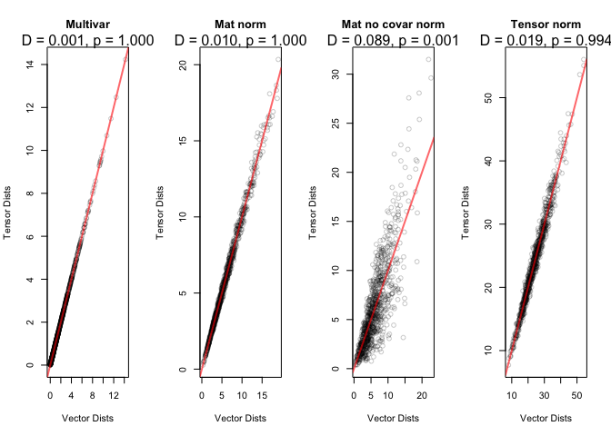

# Diagnostic Tests for Tensor Models

This document collects the diagnostic-test material from the README, including the Mahalanobis-distance normality diagnostic, likelihood ratio tests for restricted covariance matrices, and AIC/BIC model comparison.

## Setup for Diagnostic Examples

The diagnostic examples below use simulated multivariate, matrix-variate, and tensor-variate normal draws.

``` r
library("tensormodels")
library("tidyverse")

old_digits <- getOption("digits")
options(digits = 3)

S1 <- crossprod(matrix(data = c(1, 0.5, 0.5, 1), nrow = 2))
multivar_draws <- rtnorm(n = 1000, mu = c(2, 3), sigmas = list(S1))

matrix_draws <- rtnorm(n = 1e3, mu = matrix(1:6, nrow = 2, ncol = 3))

mu_true <- array(1:24, dim = c(3, 4, 2))

S1 <- crossprod(matrix(rnorm(9), nrow = 3))
S2 <- crossprod(matrix(rnorm(16), nrow = 4))
S3 <- crossprod(matrix(rnorm(4), nrow = 2))

tvn_draws <- rtnorm(n = 1e3, mu = mu_true,
                    sigmas = list(S1, S2, S3))
```

## Assessing Tensor Variate Normality

We assess tensor variate normality using the Mahalanobis distance. If \(\mathcal{X}\) follows an order-\(O\) tensor variate normal distribution, then \(\text{vec}(\mathcal{X})\) follows a multivariate normal distribution with mean \(\text{vec}(\mathcal{M})\) and covariance matrix \(\boldsymbol{\Sigma}_{O} \otimes \cdots \otimes \boldsymbol{\Sigma}_{1}\). This is why we can vectorize the tensor draws and compare the multivariate Mahalanobis distances to the tensor variate Mahalanobis distances. If we have properly reconstructed the structure using the MLEs \(\hat{\mathcal{M}}\) and \(\hat{\Sigma}_{O}, \cdots \hat{\Sigma}_{1}\), then the standardized draws should be from a standard normal.

If a tensor normal covariance structure is present, then the multivariate and tensor variate distances should be close to one another. Following the matrix variate normality paper, this can be visualized with a distance-distance plot: when the tensor normal structure is appropriate, the distances lie close to the reference line; when the Kronecker product structure is absent, the distances diverge.

The function `mahalanobis_dist()` computes both distances using fitted MLEs, and `mahalanobis_test()` performs a two-sample Kolmogorov-Smirnov test to compare their empirical distributions.

``` r
A <- matrix(rnorm(6^2), 6, 6)
s_vec <- crossprod(A)   # positive definite, general covariance

vec_draws <- rtnorm(n = 1e3, mu = 1:6, sigmas = list(s_vec))

matrix_nocovar_draws <- lapply(1:1e3, function(i) {
  array(vec_draws[[i]], dim = c(2, 3))
})
```

``` r
plot_malanobis <- function(draws, title = "Dist") {
  distances <- mahalanobis_dist(draws)
  test <- mahalanobis_test(distances)
  plot_dist(distances)
  title(main = title)
  with(test, mtext(text = sprintf("D = %.3f, p = %.3f", statistic, p.value)),
       side = 3, line = 1)
}
```

``` r
par(mfcol = c(1, 4))
plot_malanobis(multivar_draws, title = "Multivar")
plot_malanobis(matrix_draws, title = "Mat norm")
plot_malanobis(matrix_nocovar_draws, title = "Mat no covar norm")
plot_malanobis(tvn_draws, title = "Tensor norm")
```



## Likelihood Ratio Tests for Restricted Covariance Matrices

We are also interested in performing a likelihood ratio test. We are curious if one of the covariance matrices might be the identity matrix. Thus, we run the algorithm and restrict these matrices.

For a restriction set \(\mathcal{R} \subset \{1,\ldots,D\}\), the restricted model fixes \(\Sigma_r = I_{n_r}\) for every \(r \in \mathcal{R}\), while all other covariance matrices are estimated. The likelihood ratio test compares

$$H_0: \Sigma_r = I_{n_r} \ \forall r \in \mathcal{R} \quad \text{vs.} \quad H_A: \Sigma_r \neq I_{n_r} \ \text{for at least one } r \in \mathcal{R}.$$

The test statistic is

$$2\{\ell(\hat\theta_{\mathrm{full}}) - \ell(\hat\theta_{\mathcal{R}})\}
\sim \chi^2_{\nu_{\mathcal{R}}}, \quad \nu_{\mathcal{R}} = \sum_{r \in \mathcal{R}} \biggl\{\frac{n_r(n_r+1)}{2} - 1\biggr\}$$

If the \(p\)-value is large, then we fail to reject the null hypothesis and conclude the restricted model fits the data as well as the unrestricted model. If the \(p\)-value is small, we reject the null hypothesis, which states the unrestricted model has a significantly better fit than the restricted model.

``` r
true_str <- kronecker(S3, S2) |> kronecker(S1)

test_restrict <- function(draws, restrict) {
  curr_restrict <- tensor_mle(draws, restrict = restrict, model = "normal")

  if(is.null(restrict)) restrict <- "None"

  curr_str <- with(curr_restrict, kronecker(sigmas[[3]], sigmas[[2]]) |>
                                  kronecker(sigmas[[1]]))

  tibble(mse = mean((curr_str - true_str)^2),
         loglik = curr_restrict$loglik,
         k = curr_restrict$k,
         BIC = curr_restrict$BIC,
         restrict = paste(restrict, collapse = ", "))
}

(res <- map_dfr(list(NULL, c(1), c(2), c(3), c(1, 2), c(1, 3), c(2, 3)),
        draws = tvn_draws, test_restrict))
```

``` text
# A tibble: 7 x 5
      mse  loglik     k     BIC restrict
    <dbl>   <dbl> <dbl>   <dbl> <chr>
1 0.00724 -42243.    41  84769. None
2 1.80    -51553.    36 103354. 1
3 2.47    -56939.    32 114099. 2
4 3.91    -60844.    39 121958. 3
5 3.39    -65847.    27 131881. 1, 2
6 4.34    -69754.    34 139742. 1, 3
7 4.49    -75248.    30 150703. 2, 3
```

``` r
lrt_test <- function(draws, restrict) {
  full_model <- tensor_mle(draws, model = "normal")
  restrict_model <- tensor_mle(draws, model = "normal", restrict = restrict)

  pval <- pchisq(2 * (full_model$loglik - restrict_model$loglik),
                 df = full_model$k - restrict_model$k, lower.tail = FALSE)

  tibble(restrict = paste(restrict, collapse = ", "),
         pval = pval)
}

map_dfr(list(NULL, c(1), c(2), c(3), c(1, 2), c(1, 3), c(2, 3)),
        draws = tvn_draws, lrt_test)
```

``` text
# A tibble: 7 x 2
  restrict  pval
  <chr>    <dbl>
1 ""           1
2 "1"          0
3 "2"          0
4 "3"          0
5 "1, 2"       0
6 "1, 3"       0
7 "2, 3"       0
```

``` r
true_str <- kronecker(S3, diag(4)) |> kronecker(S1)

second_identity <- rtnorm(n = 1e3, mu = mu_true,
                          sigmas = list(S1, diag(4), S3))

map_dfr(list(NULL, c(1), c(2), c(3), c(1, 2), c(1, 3), c(2, 3)),
        draws = second_identity, test_restrict)

map_dfr(list(NULL, c(1), c(2), c(3), c(1, 2), c(1, 3), c(2, 3)),
        draws = second_identity, lrt_test)
```

## AIC/BIC Model Comparison

The function `model_compare()` fits candidate tensor models and returns a data frame with the model name, log likelihood, number of parameters `k`, AIC, BIC, and the fitted model object. The model with the lowest BIC can then be selected for downstream analysis.

``` r
make_skew <- function(dims, strength = 1) {
  A <- array(rnorm(prod(dims)), dim = dims)
  A / sqrt(sum(A^2)) * strength
}
```

``` r
s1 <- crossprod(matrix(rnorm(4), nrow = 2))
s2 <- crossprod(matrix(rnorm(9), nrow = 3))
s3 <- crossprod(matrix(rnorm(16), nrow = 4))

skew_true <- make_skew(dims = c(2, 3, 4), strength = 1.5)

draws <- rtskewt(n = 1e3, mu = array(1:24, dim = c(2, 3, 4)),
                 sigmas = list(s1, s2, s3), skew = skew_true,
                 nu = 40)

model_compare <- function(draws) {
  res_normal <- tensor_mle(draws, model = "normal", quiet = FALSE)
  res_skewt <- tensor_mle(draws, model = "skewt", quiet = FALSE)
  res_vargam <- tensor_mle(draws, model = "vargamma", quiet = FALSE)
  res_invgauss <- tensor_mle(draws, model = "invgauss", quiet = FALSE)
  res_genhyper <- tensor_mle(draws, model = "genhyper", quiet = FALSE)

  tibble(model = c("Normal", "Skewt", "Vargamma", "Invgauss", "Genhyper"),
         loglik = c(res_normal$loglik, res_skewt$loglik,
                    res_vargam$loglik, res_invgauss$loglik, res_genhyper$loglik),
         k = c(res_normal$k, res_skewt$k,
               res_vargam$k, res_invgauss$k, res_genhyper$k),
         AIC = c(res_normal$AIC, res_skewt$AIC,
                 res_vargam$AIC, res_invgauss$AIC, res_genhyper$AIC),
         BIC = c(res_normal$BIC, res_skewt$BIC,
                 res_vargam$BIC, res_invgauss$BIC, res_genhyper$BIC),
         mod_obj = list(res_normal, res_skewt, res_vargam, res_invgauss, res_genhyper))
}

res <- model_compare(draws)
print(res)

best_mod <- res$mod_obj[[which.min(res$BIC)]]
res$model[which.min(res$BIC)]
```
