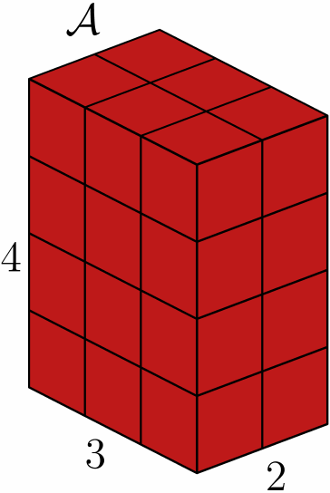

## Flattening is easy—but it erases the questions we care about

::: {.columns}
::: {.column width="58%"}
Multiway measurements are naturally indexed by several modes:

sensor × time × location 
gesture × channel × phase 
subject × feature × condition

:::

::: {.column width="42%"}
- Vectorization hides which mode drives dependence.
- A full covariance becomes enormous.
- Normality can be a severe convenience assumption.
:::
:::

The modeling object should preserve the structure of the measurement process.

::: {.notes}
Suggested pace: 1:10.

Open with the practical tension. Modern instruments routinely return arrays rather than single vectors: repeated signals over channels and time, spatial measurements over several conditions, or images collected across subjects. We can always flatten those arrays, but then the covariance no longer tells us whether dependence is temporal, spatial, or sensor-specific. The alternative—an unrestricted covariance on every tensor entry—quickly becomes impossible to estimate. The package starts from the idea that the data structure is not an inconvenience to remove; it is information we should use. A second issue is distributional: forcing every tensor to be normal can hide skewness and heavy tails.
:::

## A tensor keeps every source of variation visible

::: {.columns}
::: {.column width="38%"}
::: {.tensor-figure}
{fig-alt="A three-dimensional tensor drawn as a four by three by two block"}
:::
:::

::: {.column width="62%"}

Order and mode

An order-$D$ tensor requires $D$ indices to locate an entry.

<strong>Mode</strong> identifies an axis and its scientific meaning.

<strong>Matricization</strong> exposes one mode as matrix rows.

<strong>$n$-mode products</strong> transform one mode at a time.

:::
:::

The same operations used to describe tensors also power covariance estimation and whitening.

::: {.notes}
Suggested pace: 1:10.

Establish only the notation needed for the rest of the talk. The order is the number of indices required to locate an entry; a mode is one specific axis. The important point is that modes carry meaning. Matricization lets us focus on one mode by placing it in the rows of a matrix, while an n-mode product applies a matrix transformation along one axis without destroying the rest of the array. These are not merely algebra helpers. In tensortools, matricization is used to initialize and update mode-specific covariance estimates, and n-mode products apply covariance factors during simulation, likelihood evaluation, and diagnostic whitening.
:::

## Separable covariance makes high-dimensional modeling feasible

$$
\operatorname{vec}(\mathcal X)
\sim \mathcal N\!\left(
\operatorname{vec}(\mathcal M),
\Sigma_D \otimes \cdots \otimes \Sigma_1
\right)
$$

$\tfrac{P(P+1)}{2}$
unrestricted covariance parameters $P=\prod_d n_d$

$\sum_d \tfrac{n_d(n_d+1)}{2}$
mode-specific covariance parameters before scale constraints

Each $\Sigma_d$ summarizes dependence along one scientifically meaningful mode.

::: {.notes}
Suggested pace: 1:20.

This is the central statistical assumption. Once the tensor is vectorized, the covariance is restricted to a Kronecker product of mode-specific covariance matrices. If the tensor has P entries, an unrestricted model needs P times P-plus-one over two covariance parameters. The separable model replaces that with a sum over the much smaller mode dimensions. The reduction is often dramatic, but interpretation improves as well: each Sigma describes dependence along a single axis. This is a curved, lower-dimensional subset of the full multivariate normal model, so it is an assumption to be evaluated rather than taken for granted. The diagnostics later in the talk are designed to do exactly that.
:::

## One latent scale creates four skewed tensor families

$$
\mathcal X = \mathcal M + W\mathcal A + \sqrt{W}\,\mathcal V,
\qquad
\mathcal V \sim \mathcal{TN}\!\left(\mathcal O,\{\Sigma_d\}_{d=1}^D\right)
$$

<table class="family-table">
<thead><tr><th>Tensor family</th><th>Mixing distribution for $W$</th><th>Shape parameter</th></tr></thead>
<tbody>
<tr><td>Skew-$t$</td><td>Inverse-gamma</td><td>$\nu$</td></tr>
<tr><td>Generalized hyperbolic</td><td>Generalized inverse Gaussian</td><td>$\lambda,\omega$</td></tr>
<tr><td>Variance-gamma</td><td>Gamma</td><td>$\gamma$</td></tr>
<tr><td>Normal inverse Gaussian</td><td>Inverse Gaussian</td><td>$\kappa$</td></tr>
</tbody>
</table>

Common construction: normal variance–mean mixtures (Barndorff-Nielsen, Kent & Sørensen, 1982).

::: {.notes}
Suggested pace: 1:35.

The tensor normal is the baseline, not the endpoint. A shared variance–mean mixture introduces both skewness and tail flexibility. M is location, A is a skewness tensor, V carries the tensor-normal covariance, and W is a positive latent variable. The linear W A term shifts the mean in a preferred direction, while square-root W scales the random variation. Changing only the distribution of W gives the four non-normal families implemented in the package: skew-t, generalized hyperbolic, variance-gamma, and normal inverse Gaussian. This common representation is important computationally because the families can share much of the same estimation machinery rather than requiring four unrelated implementations.
:::

## A single package supports the full modeling loop

Represent→
Simulate & evaluate→
Fit→
Diagnose→
Reduce

array / list
rt*() · dt*()
tensor_mle()
mahalanobis_*()
cp() · tucker() · hosvd() · tt()

::: {.columns}
::: {.column width="50%"}
### Probability models

Random generation, densities, likelihood fitting, and distribution-specific parameters.
:::

::: {.column width="50%"}
### Tensor infrastructure

Matricization, mode products, Khatri–Rao products, decompositions, and reconstruction.
:::
:::

The contribution is an integrated statistical workflow—not only a tensor data structure.

::: {.notes}
Suggested pace: 1:10.

Position the package as an end-to-end workflow. Users can keep tensors as ordinary R arrays and independent draws as lists of arrays. Familiar r-prefix and d-prefix functions provide simulation and density evaluation. A single tensor_mle interface selects the distributional family. Mahalanobis-based tools assess whether the fitted separable structure is plausible, and standard decompositions support approximation or dimension reduction. Underneath, the same tensor algebra functions are available directly and reused internally. The package therefore connects two activities that are often separated in software: probability modeling for tensor-valued observations and the algebra required to compute with them.
:::

## Fitting alternates between smaller mode-specific problems

::: {.columns}
::: {.column width="50%"}
### Tensor normal

- Estimate location and each $\Sigma_d$
- Update one mode while holding the others fixed
- Iterate the **flip-flop algorithm** to convergence
:::

::: {.column width="50%"}
### Skewed families

- Treat $W$ as latent
- Alternate conditional expectations and parameter updates
- Reuse a shared **EM framework** across families
:::
:::

Trace normalization resolves the scale ambiguity among Kronecker factors while preserving the full covariance.

::: {.notes}
Suggested pace: 1:30.

For the tensor normal, the likelihood equations for the covariance factors depend on one another. The flip-flop algorithm updates one mode-specific covariance at a time while holding the others fixed, then repeats until the relative likelihood change falls below tolerance. The skewed families use an EM algorithm because the positive mixing variable W is latent. Conditional moments of W enter the updates, but the common mixture form allows the overall structure to be shared. Initialization uses a robust location based on the median, matricized scatter matrices for each mode, and conservative starting values for family-specific shape parameters. A key identifiability issue is that scaling one Kronecker factor and inversely scaling another leaves the full covariance unchanged. The package normalizes the traces of all but the final factor.
:::

## Diagnostics ask whether the tensor structure earns its simplicity

$$ d_{\text{tensor}}(\mathcal X) \;\approx\; d_{\text{vector}}\!\left(\operatorname{vec}(\mathcal X)\right) $$

::: {.columns}
::: {.column width="50%"}
### Distance-based check

- Whiten residuals mode by mode
- Compare tensor and vectorized Mahalanobis distances
- Use a distance–distance plot and KS test
:::

::: {.column width="50%"}
### Structure test

- Fit full and restricted models
- Test $H_0:\Sigma_r=I_{n_r}$ for selected modes
- Use a likelihood-ratio statistic
:::
:::

Separable covariance is a testable modeling choice, not a free computational shortcut.

::: {.notes}
Suggested pace: 1:25.

The parameter reduction is valuable only when the separable structure is credible. The first diagnostic uses Mahalanobis distances. If the mode-specific covariance estimates correctly reconstruct the dependence, tensor-whitened residuals should behave like a standard normal, and tensor distances should align with distances computed after vectorization. The package supplies the distances, their comparison, a distance-distance plot, and a two-sample Kolmogorov-Smirnov test. A second diagnostic asks a more targeted question: can one or more mode covariances be replaced by the identity? The likelihood-ratio test compares a restricted model against the full fit. Together these tools assess the overall separable structure and whether particular modes contribute meaningful covariance.
:::

## Decompositions complement—not replace—probability models

::: {.compact}
- **CP / PARAFAC** approximates a tensor with a sum of rank-one components.
- **Tucker** separates a smaller core from mode-specific factor matrices.
- **HOSVD** gives orthogonal mode factors and ordered mode singular values.
- **Tensor-Train** represents an order-$D$ tensor as a chain of low-order cores.
:::

Every decomposition is paired with an explicit reconstruction function, making approximation error easy to inspect.

Foundational references include Hitchcock (1927), Carroll & Chang (1970), De Lathauwer et al. (2000), and Oseledets (2011).

::: {.notes}
Suggested pace: 1:05.

Decompositions answer a different question from probability models. A distribution describes uncertainty and dependence across independent tensor-valued observations; a decomposition summarizes or approximates the structure within a tensor. The package supports both. CP or PARAFAC uses a sum of rank-one components. Tucker uses a smaller core linked to factor matrices for every mode. HOSVD adds orthogonality and ordered mode singular values. Tensor-Train uses a sequence of small cores and can select ranks using a target approximation accuracy. Each algorithm has a reconstruction partner, so users can immediately evaluate how much information the reduced representation retains.
:::

## The design stays close to ordinary R workflows

::: {.columns}
::: {.column width="48%"}

Inputs

- One draw: a base R array
- IID sample: a list of arrays
- Covariance: a list with one matrix per mode
:::

::: {.column width="52%"}

Outputs

- Model fits: ordinary named lists
- Parameters: arrays, matrices, and scalars
- Decompositions: factors plus reconstruction helpers
:::
:::

Users can inspect, subset, and extend results without learning a new class hierarchy.

::: {.notes}
Suggested pace: 0:55.

This is an intentional package-design choice. A single tensor draw is a base R array. A sample of independent tensor draws is a list of arrays, which avoids inventing an extra sample mode whose position could be confused with a scientific mode. Mode-specific covariances are supplied as a list with one square matrix per axis. Fits are also ordinary named lists: the location array, covariance matrices, likelihood summaries, convergence information, and—for skewed models—the skewness array and family parameters. This keeps the package close to familiar R behavior and makes the results straightforward to inspect or reuse.
:::

## The gap is statistical modeling—not another tensor algebra library

::: {.columns}
::: {.column width="48%"}
### Most tensor toolkits emphasize

- Specialized tensor classes
- Contractions and mode products
- CP, Tucker, HOSVD, or Tensor-Train
- Computational backends
:::

::: {.column width="52%"}
### `tensortools` adds

- Tensor-normal and four skewed distributions
- Random generation and density evaluation
- Likelihood and EM estimation
- Model diagnostics for covariance structure
:::
:::

Tensor algebra is the infrastructure; tensor-valued inference is the distinguishing layer.

::: {.notes}
Suggested pace: 1:05.

Several excellent ecosystems already cover tensor representation and decomposition: MATLAB Tensor Toolbox, TensorLy and pyttb in Python, TensorOperations and related packages in Julia, and rTensor or ttTensor in R. Their center of gravity is algebra, decomposition, sparse or factored representations, and computational backends. Tensortools deliberately overlaps on the core operations needed for statistical work, but its distinctive contribution is distributional: tensor-normal and skewed probability models, simulation and densities, maximum-likelihood or EM estimation, and diagnostics for the covariance assumptions. That is the gap the package is intended to fill.
:::

## Take the structure seriously—and test it {.close-slide}

<ol class="takeaway-list">
<li><strong>Preserve the modes.</strong> Kronecker covariance turns structure into both parsimony and interpretation.</li>
<li><strong>Allow non-normal shapes.</strong> One mixture representation supports four skewed, heavy-tailed families.</li>
<li><strong>Close the loop.</strong> Fit, diagnose, and reduce tensor-valued data with familiar R objects.</li>
</ol>

`tensortools` makes multiway structure a modeling asset rather than a preprocessing obstacle.

::: {.notes}
Suggested pace: 0:55, then questions.

Return to the opening tension. Flattening is always possible, but it discards the mode structure we want to understand. A separable Kronecker covariance offers a parsimonious and interpretable alternative. The tensor normal provides a starting point, while a shared variance–mean mixture extends the framework to skewness and heavy tails. Flip-flop and EM algorithms make estimation practical, and the diagnostic tools check whether the structural assumptions actually hold. Finally, the package keeps the workflow in ordinary R arrays and lists and complements inference with standard decompositions. The central message is that multiway structure is not something to remove before analysis—it can guide the model itself.
:::
